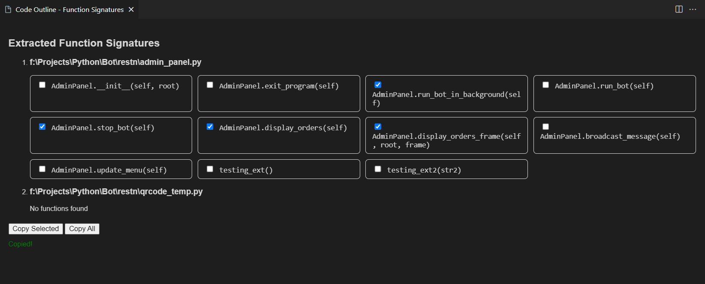

# Code Outline: Function Signature Extractor

A lightweight VS Code extension that helps you **extract all function/method headers** (signatures) from selected files in your workspace. Perfect for quickly reviewing, documenting, or copying the functional structure of your code.

---

## ✨ Features

- ✅ Extracts function headers (names and parameters) from open files or selected files in the workspace.
- 📂 Select multiple files from your workspace
- 🔍 Automatically parses and lists all function/method signatures
- 🧠 Supports nested functions and class methods
- 📋 Supports language filtering (e.g., Python, JavaScript)
- 🖱️ Displays results in a web panel with clean formatting
- ✅ "Select All" and individual selection checkboxes for copying
- 📋 Easily copy selected or all signatures for documentation or refactoring

---

## 📸 Example

---

## ⚙️ Requirements

No special requirements — works out of the box with VS Code’s built-in language server and document symbol provider.  
Make sure files have the correct language mode (e.g., Python, JavaScript).

---

## Manual Installation (Without Marketplace)

If you install the extension manually from the `.vsix` package file, follow the following steps.

### How to install from a `.vsix` file:

1. Download the `.vsix` file from the [Releases](https://github.com/your-repo/your-extension/releases) page or wherever you host it.

2. Open Visual Studio Code.

3. Press `Ctrl+Shift+P` (or `Cmd+Shift+P` on Mac) to open the Command Palette.

4. Type and select:  
   `Extensions: Install from VSIX...`

5. Browse to the downloaded `.vsix` file and select it.

6. VS Code will install the extension. Reload or restart VS Code if prompted.

---

## Extension Usage

1. Open the Command Palette (`Ctrl+Shift+P` or `Cmd+Shift+P`).
2. Run the command **"Outline My Code"**.
3. Select the type of files (e.g., .py, .js, etc.).
3. Select one or more files from the workspace.
4. A side panel will open displaying all function headers grouped by file.
5. Check the boxes next to functions you want to copy, or use **Copy All**.
6. Paste the copied signatures anywhere you want (documentation, notes, etc.).

---

## 🛠 Extension Settings

This extension currently does not introduce custom settings. Future updates may add:

- Signature formatting options
- Output destination preferences

---

## 🐞 Known Issues

- Signature extraction relies on VS Code's built-in symbol providers, which may vary in accuracy between languages.
- Currently optimized for Python and JavaScript. Other languages may need more customization for full support.
- Large files with many functions might slow down extraction slightly.

---

## 🚀 Release Notes

### 1.0.0

- Initial release of **Code Outline: Function Signature Extractor**
- Supports multi-file selection
- Extracts function headers using VS Code’s document symbol API
- Responsive UI with multi-column function cards and selection.
- Lists functions in a user-friendly WebView with copy options

---

## Future Work / Planned Features

### Integration with Free GPT API for Automated Documentation

An upcoming enhancement is integrating a free GPT-based API to automatically generate meaningful documentation based **solely on extracted function headers (signatures)**. This feature will help users:

- Quickly generate human-readable summaries and explanations of the functions and methods found in their code files.
- Save time writing documentation by leveraging AI-generated text.
- Improve code understanding.

Stay tuned for this feature in upcoming releases to enhance your documentation workflow with AI-powered assistance!

---

## Feedback

Feedback is welcome! Please contact us on rowan00omar@gmail.com.

---

## 📚 For More Information

- [VS Code Extension API](https://code.visualstudio.com/api)
- [Markdown Syntax Reference](https://www.markdownguide.org/basic-syntax/)

---

Enjoy with **code-outline**!

